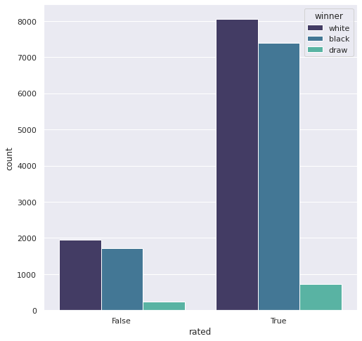
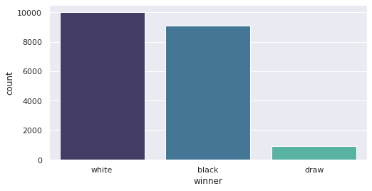
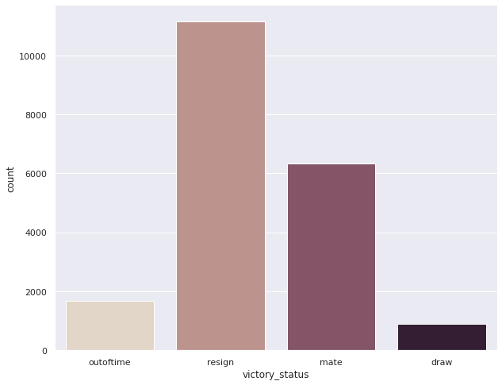
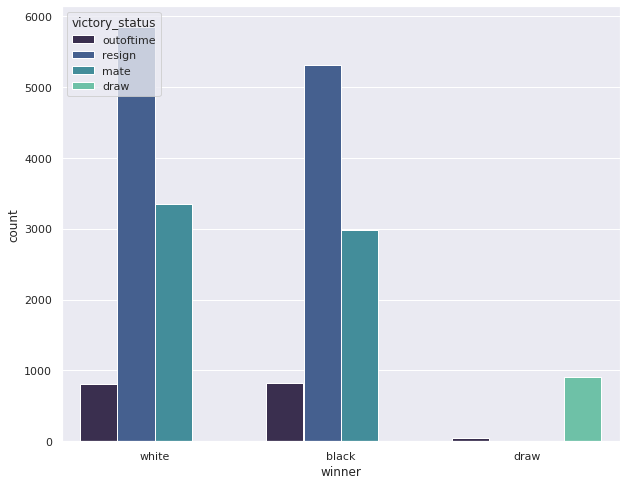
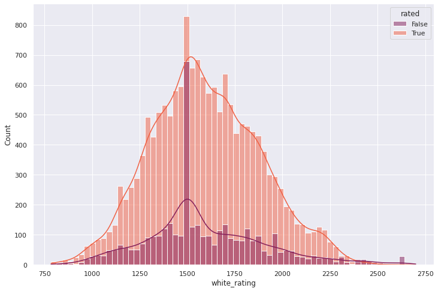
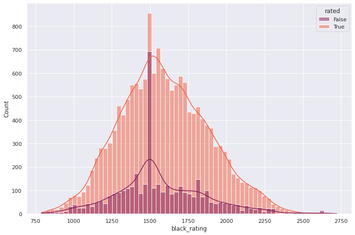
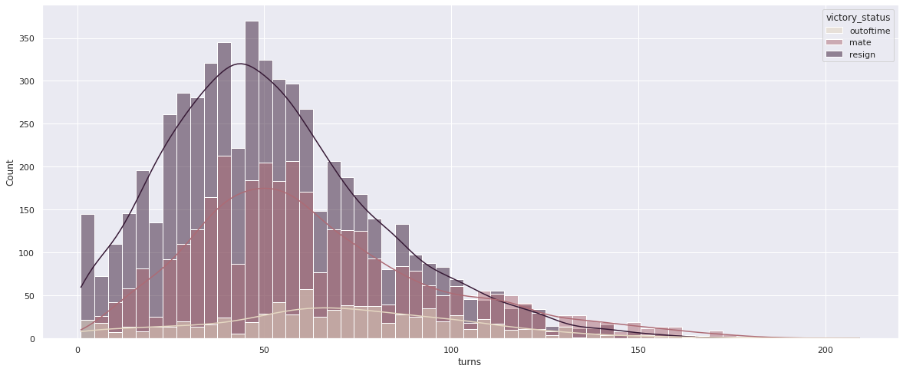
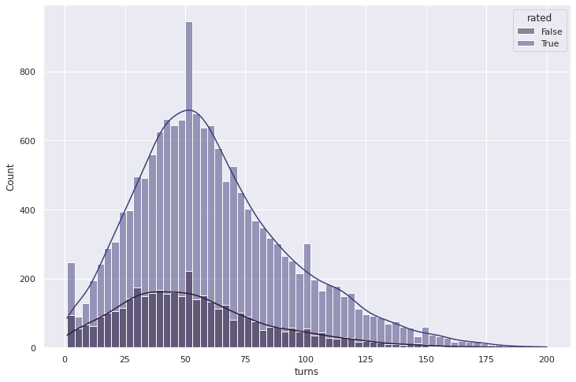

# An analysis of 20000 chess games collected from lichess.org 
[chess_EDA.ipynb](chess_EDA.ipynb)

- The most active players.
- How the ratings of the most active players change with every game they play.
- The highest rated players.
- Most popular chess openings.
- Least popular openings
- Openings that favoured black players.
- Openings that favoured white players.

### Graphical univariate and multivariate analysis
[basic_EDA.ipynb](basic_EDA.ipynb)
More than two thirds of the games in lichess are rated, most of them being won by white and very few games ending as a draw.This is true in both rated and unrated games.

 

Most games end as a result of one of the players resigning rather than a check mate or a time out,and only 5% of the games result in a draw.This is true for all games regardless of the winning player(black or white).

  

The ratings of the most active players on Lichess fall under the range 1250 to 1800.With players having a rating of 1500 being the most active.This is true for both black and white players.

  

Most games have a total of 45 to 75 turns

 

[chess_EDA.ipynb](chess_EDA.ipynb)
The most active players
How the ratings of the most active players change with every game they play
The highest rated player.
Most popular chess openings.
Openings that favoured black players.
Openings that favoured white players.
